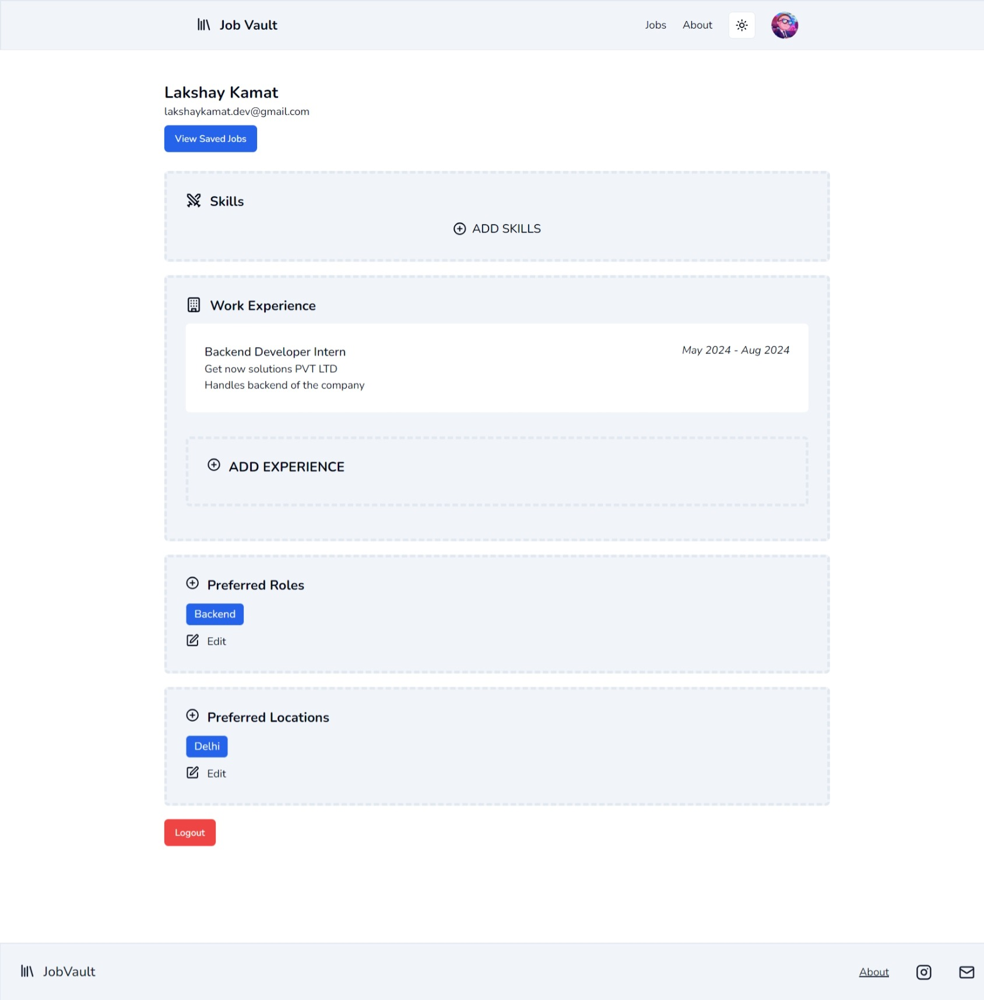

# JobVault

JobVault is a comprehensive job portal that offers a seamless experience for job seekers and employers. It combines a Next.js client for displaying job listings, a scraper server for fetching jobs from popular job portals like LinkedIn, Indeed, and Naukri, and a main server that provides API routes for client interactions.

## Screenshots

#### Landing Page

#### Jobs Page

#### Jobs Details

#### Profile Page

#### Login Pages

#### Architecture

[View on Eraser](https://app.eraser.io/workspace/VUWUqpfiSeLiK2laPiUJ?elements=5MH8BLQCkwQqVDx_tnnZMw)

## Features

### Next.js Client

The Next.js client serves as the frontend interface for JobVault, providing users with a highly interactive and responsive experience. Key functionalities include:

- **Job Listings**: Users can view a comprehensive list of available jobs with detailed information about each position.
- **Filtering and Searching**: Users can filter job listings based on various criteria such as location, job type, skills required, and more, to find the most relevant opportunities.
- **Save Jobs**: Users can save job postings to their profile, allowing them to easily revisit and apply for jobs at their convenience.
- **Job Applications**: Users can apply for jobs directly through the portal, streamlining the job application process.

### Scraper Server

The scraper server plays a critical role in ensuring that JobVault has the latest job listings from multiple popular job portals. Key functionalities include:

- **Job Scraping**: The server scrapes job listings from LinkedIn, Indeed, and Naukri, aggregating them into a single database.
- **Data Extraction**: It extracts relevant job details such as job title, company, location, requirements, and more.
- **Job Updates**: The scraper is scheduled to run at regular intervals to ensure the database is up-to-date with the latest job postings.
- **Performance**: Capable of extracting 20,000 jobs within a 6-hour timeframe, ensuring a rich and diverse pool of job listings for users.

### Main Server

The main server is the backbone of JobVault, managing all the backend operations and providing API routes for client interactions. Key functionalities include:

- **User Authentication**: Manages user registration, login, and authentication using JWT tokens to ensure secure access.
- **User Profile Management**: Allows users to manage their profiles, including updating skills, work experience, and other personal details.
- **Job Management**: Manages job listings, including fetching, saving, and applying for jobs.
- **API Routes**: Provides a comprehensive set of API routes for all client interactions, ensuring smooth communication between the frontend and backend.

## Project Workflow

1. **Landing Page**: Users are greeted with a visually appealing landing page that provides an overview of JobVault's features and benefits.
2. **User Registration/Login**: New users can sign up, and existing users can log in to access their profiles and job listings.
3. **Job Listings**: Once logged in, users can browse through a curated list of job postings, filtered according to their preferences.
4. **Job Details**: Users can click on a job listing to view detailed information about the position, including job description, requirements, and company details.
5. **Save and Apply**: Users have the option to save jobs to their profile or apply directly through the portal.
6. **Profile Management**: Users can update their profile information, including skills and work experience, to make themselves more attractive to potential employers.

### Architecture

JobVault's architecture ensures efficient and scalable operations:

- **Next.js Client**: The frontend is built using Next.js, providing a fast and responsive user interface.
- **Main Server**: The backend server, built with Node.js and Express, handles all API requests, user authentication, and data management.
- **Scraper Server**: A dedicated server for scraping job listings from external job portals, ensuring the database is always updated with the latest opportunities.
- **Database**: MongoDB is used to store user profiles, job listings, and other relevant data, ensuring high performance and scalability.

## Conclusion

JobVault is designed to provide a seamless and comprehensive job search experience. With its robust architecture and user-friendly interface, it empowers job seekers to find their ideal jobs effortlessly and efficiently. Whether you are a job seeker looking for new opportunities or an employer looking to post job listings, JobVault is your go-to platform for all your job search needs.
